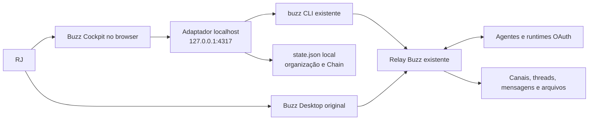

# Arquitetura técnica

## Visão geral

O cockpit é uma aplicação React/Vite servida por um processo Node local. Esse
processo expõe uma API pequena e fechada que executa somente operações conhecidas
do `buzz` CLI. Não existe um backend alternativo de agentes.



Os dois frontends chegam ao mesmo relay por caminhos independentes. Encerrar o
cockpit não afeta o Desktop; remover o estado local não remove mensagens do Buzz.

## Componentes

### Frontend

O frontend fica em `cockpit/src/` e é responsável por:

- roteamento local;
- importação dos canais como projetos;
- carregamento e normalização das conversas;
- projeções Reader e Operator;
- timeline, mídia, roster, Attention e Mission Workspace;
- política local do loop e reconciliação de respostas;
- persistência do estado visual pelo endpoint `/api/state`.

Ele não recebe identidade privada, `auth_tag` nem credencial de managed agent.

### Servidor e adaptador

O servidor fica em `cockpit/server/` e tem duas responsabilidades:

1. servir o bundle Vite ou o middleware de desenvolvimento;
2. validar requests HTTP e convertê-los em uma allowlist de comandos do CLI.

`server.mjs` define as rotas HTTP. `adapter.mjs` resolve a instalação do Buzz,
credenciais existentes, valida entradas, constrói arrays de argumentos e executa
subprocessos com `shell: false`.

### Buzz existente

O CLI e o relay continuam responsáveis por:

- canais e membros;
- eventos, replies e threads;
- envio e assinatura de mensagens;
- upload e download de mídia;
- presença;
- drafts de configuração de agentes.

O cockpit não reimplementa nenhuma dessas regras.

## Propriedade dos dados

| Dado | Fonte de verdade | Observação |
| --- | --- | --- |
| Canais e membros | Buzz relay | Lidos pelo CLI. |
| Mensagens, replies e edições | Buzz relay | Recarregadas e normalizadas no browser. |
| Arquivos e mídia | Buzz relay/Blossom | Obtidos pelo CLI autenticado. |
| Perfis e presença | Buzz + managed agents | Projetados para campos seguros. |
| Projeto ↔ canal | `state.json` | Vínculo local pelo UUID estável. |
| Missões e conversas vinculadas | `state.json` | Organização do cockpit. |
| Dispatches, prompt outbound, recibos e Chain | `state.json` | Estado visual/operacional local. |
| Attention | `state.json` | Exceções do loop local. |
| Filtro Reader | Memória do frontend | Projeção derivada; não altera o evento. |

O tipo `CockpitState` ainda contém arrays de compatibilidade para agentes e
mensagens de exemplo. O fluxo ao vivo não cacheia o histórico recebido, mas
persiste brief, objetivo e o texto outbound de cada dispatch como metadados
locais da missão.

## Inicialização

Ao iniciar, `server/index.mjs` resolve:

1. caminho do CLI;
2. caminho do arquivo de managed agents;
3. URL do relay;
4. identidade do owner;
5. caminho do estado local;
6. porta local.

Em seguida, cria o servidor e escuta somente em `127.0.0.1`.

O frontend primeiro solicita health e estado em paralelo. Depois que ambos
respondem, solicita canais, agentes e feed em um segundo grupo paralelo. Canais
ativos elegíveis são enriquecidos, importados idempotentemente como projetos e
salvos se o vínculo mudou.

## Descoberta da infraestrutura existente

### CLI

Ordem de resolução:

1. `BUZZ_CLI_PATH`;
2. `/Applications/Buzz.app/Contents/MacOS/buzz`;
3. executável `buzz` encontrado no `PATH`.

O adaptador não baixa nem compila outro CLI.

### Relay

Ordem de resolução:

1. `BUZZ_COCKPIT_RELAY_URL`;
2. primeiro `relay_url` válido do arquivo de managed agents do Buzz.

URLs `ws://` e `wss://` são normalizadas para o esquema HTTP equivalente usado
pelo CLI. URLs com usuário ou senha embutidos são rejeitadas.

### Identidade

Ordem de resolução:

1. `BUZZ_PRIVATE_KEY`, se explicitamente fornecida ao processo;
2. identidade já guardada no Keychain macOS pelo serviço `buzz-desktop`.

A identidade entra somente no ambiente do subprocesso. Ela não é devolvida por
`/api/health`, não é gravada no estado e é removida de mensagens de erro.

### Credencial de draft de agente

`agents:draft-update` não usa indiscriminadamente a identidade do owner. O
adaptador seleciona exatamente um managed agent por nome/display name/slug,
localiza seu `auth_tag` e a chave correspondente no Keychain e falha fechado se
o resultado for ausente ou ambíguo.

## API localhost e mapeamento CLI

O prefixo `/api/` não oferece uma rota genérica de execução. Cada endpoint chama
uma operação fixa.

| HTTP | Operação efetiva |
| --- | --- |
| `GET /api/health` | Verifica disponibilidade de CLI, relay e identidade; não expõe valores. |
| `GET /api/channels` | `buzz --format json channels list --member --limit 500` |
| `GET /api/channels/search?query=...` | `channels search --query ... --exact --include-archived --limit 1000` |
| `GET /api/channels/:id` | `channels get --channel <uuid>` |
| `GET /api/channels/:id/members` | `channels members --channel <uuid>` |
| `GET /api/channels/:id/messages` | `messages get --channel <uuid> [--limit] [--since] [--before] --kinds 9,40002,40003,40008,45001,45003` |
| `GET /api/channels/:id/threads/:event` | `messages thread --channel <uuid> --event <id> --limit 500` |
| `GET /api/messages/search` | `messages search [--query] [--author] [--since] [--limit]` |
| `GET /api/feed` | `feed get [--since] [--limit]` |
| `GET /api/presence?pubkeys=...` | `users presence --pubkeys <lista>` |
| `GET /api/agents` | Lê uma projeção segura do arquivo de managed agents; não usa CLI. |
| `GET /api/media/:sha256.ext` | `media get <sha256.ext>` e devolve bytes verificados. |
| `HEAD /api/media/:sha256.ext` | Mesma validação de mídia, sem corpo na resposta. |
| `GET /api/state` | Lê o JSON local; não usa CLI. |
| `PUT /api/state` | Valida e substitui atomicamente o JSON local. |
| `POST /api/messages` | `messages send --channel ... --content - [--reply-to] [--mention]* [--file]*` |
| `POST /api/agents/draft-update` | `agents draft-update` com campos allowlisted. |

Limites aplicados pelo adaptador incluem:

- `messages get`: 1 a 200 por página;
- `messages search`: até 100;
- `feed get`: até 50 efetivos;
- `users presence`: 1 a 100 pubkeys;
- event IDs: exatamente 64 caracteres hexadecimais;
- channel IDs: UUID;
- conteúdo enviado: até 65.536 bytes UTF-8.

## Importação de projetos

`importBuzzChannelProjects` recebe canais não arquivados e importa somente tipos
`stream` e `forum`.

O algoritmo:

1. normaliza e deduplica UUIDs;
2. procura um projeto já ligado ao mesmo `buzzChannelId`;
3. tenta migrar IDs determinísticos ou vínculos legados inequívocos;
4. usa o nome somente quando não há ambiguidade;
5. cria `buzz-channel:<uuid>` quando não existe vínculo;
6. registra conflitos em vez de adivinhar.

Depois da primeira importação, nome, descrição e cor pertencem ao usuário. Uma
nova leitura do canal não sobrescreve essas escolhas locais.

## Leitura e isolamento do histórico

### Página de projeto

`readProjectHistoryPages` executa `messages get` em lotes de 200. O cursor
`before` passa para um segundo anterior ao evento mais antigo do lote. A leitura
para quando:

- o lote tem menos de 200 eventos;
- não existe timestamp utilizável;
- o cursor mais antigo deixa de avançar.

Durante a leitura, lotes parciais são publicados. Depois, um polling de 12
segundos busca somente eventos posteriores ao mais recente.

O estado guarda o `projectId` correspondente à lista em memória. A troca de rota
zera a lista e incrementa um token de requisição; callbacks antigos são
ignorados. Isso evita vazamento visual entre projetos.

### Mission Workspace

Conversas vinculadas são lidas por `messages thread --limit 500`. Quando uma
referência é apenas a raiz do canal, o fallback atual lê até 200 eventos. Essa
área ainda não compartilha a paginação retroativa completa da página de projeto.
Ela também não possui ainda o token de requisição usado no projeto; uma leitura
lenta da missão anterior pode sobrescrever a lista em memória depois de uma
troca rápida de missão.

## Normalização de eventos

`normalizers.ts` aceita variações do JSON do CLI e projeta estruturas estáveis
para a UI:

- `ChannelSummary`;
- `Message`;
- `AttachmentSummary`;
- `AgentSummary`;
- `CliWriteReceipt`;
- `CockpitState`.

Tags NIP-10 identificam root e reply. Tags `imeta` geram anexos com URL, hash,
MIME type, tamanho, thumbnail e dimensões quando disponíveis.

### Reconciliação de edições

Edições Buzz `kind 40003` são agrupadas pela mensagem-alvo. A edição mais nova
substitui conteúdo e conjunto de anexos, preservando identidade, canal, thread e
audiência do evento original. O resultado final omite o evento de edição
separado.

### Projeção Reader

Depois da reconciliação, `presentation.ts` remove padrões estritos de protocolo
e simplifica caminhos internos. Operator recebe a lista reconciliada sem esse
filtro adicional.

## Envio e anexos

O navegador converte cada `File` selecionado em base64 e envia JSON ao adaptador.
O servidor:

1. valida nome e base64 canônico;
2. limita a 20 arquivos e 25 MB totais;
3. cria um diretório temporário;
4. grava arquivos com modo `0600`;
5. passa somente os caminhos criados para `--file`;
6. remove o diretório em `finally`, com sucesso ou erro.

O corpo total do endpoint de mensagens é limitado a 36 MB. O composer do
frontend aceita JPEG, PNG, GIF, WebP e MP4.

## Download de mídia

Uma rota de mídia aceita somente `<sha256 minúsculo>.<extensão segura>`. Depois
de `buzz media get`, o adaptador:

- limita a saída a 25 MB;
- calcula SHA-256 dos bytes;
- compara com o hash do nome;
- devolve MIME type conhecido ou `application/octet-stream`;
- marca o recurso como same-origin e content-addressed.

Isso permite mostrar imagens e vídeos autenticados sem entregar identidade ao
browser.

## Estado local

Caminho padrão:

```text
~/Library/Application Support/xyz.block.buzz.cockpit/state.json
```

Pode ser alterado por `BUZZ_COCKPIT_STATE_PATH`.

O write:

- aceita apenas objeto JSON;
- limita o arquivo a 1 MiB;
- limita profundidade a 20 e quantidade a 50.000 nós;
- rejeita `__proto__`, `prototype` e `constructor`;
- cria diretório com `0700`;
- grava temporário com `0600`;
- usa rename atômico;
- remove o temporário em caso de falha.

Sem arquivo, o adaptador devolve um estado vazio útil. O frontend pode então
reimportar projetos a partir dos canais reais.

## Segurança

As principais fronteiras são:

- bind exclusivo em `127.0.0.1`;
- nenhuma rota de shell arbitrário;
- subprocessos com argumentos em array e `shell: false`;
- conteúdo da mensagem enviado por stdin, não interpolado em comando;
- validação estrita de UUIDs, event IDs, limites e arquivos;
- timeout de CLI de 120 segundos;
- stdout limitado a 16 MB e stderr a 2 MB;
- redaction de identidade, `nsec` e variáveis sensíveis em erros;
- `/api/agents` remove prompts, definições e segredos;
- headers `nosniff`, `no-referrer` e `DENY` para frames;
- API JSON sem cache;
- mídia verificada por hash.

## Estrutura de arquivos

| Caminho | Responsabilidade |
| --- | --- |
| `cockpit/src/App.tsx` | Orquestra carga, rotas, persistência, envio e reconciliação. |
| `cockpit/src/ui/Views.tsx` | Home, projeto, agentes e Attention. |
| `cockpit/src/ui/MissionWorkspace.tsx` | Conversation, Chain, threads e handoffs. |
| `cockpit/src/ui/Timeline.tsx` | Projeção e renderização de mensagens/mídia. |
| `cockpit/src/ui/Composer.tsx` | Seleção de agente, destino, prompt e anexos. |
| `cockpit/src/data/normalizers.ts` | Compatibilidade do JSON do CLI e edições. |
| `cockpit/src/data/presentation.ts` | Filtro humano do Reader. |
| `cockpit/src/domain/state.ts` | Projetos, missões, vínculos e dispatches. |
| `cockpit/src/domain/guard.ts` | Limites do loop. |
| `cockpit/src/domain/handoff.ts` | Detecção explícita de próximo especialista. |
| `cockpit/server/server.mjs` | HTTP, API, arquivos estáticos e erros públicos. |
| `cockpit/server/adapter.mjs` | CLI, identidade, validação, mídia e estado. |
| `cockpit/server/index.mjs` | Boot e resolução do runtime. |
